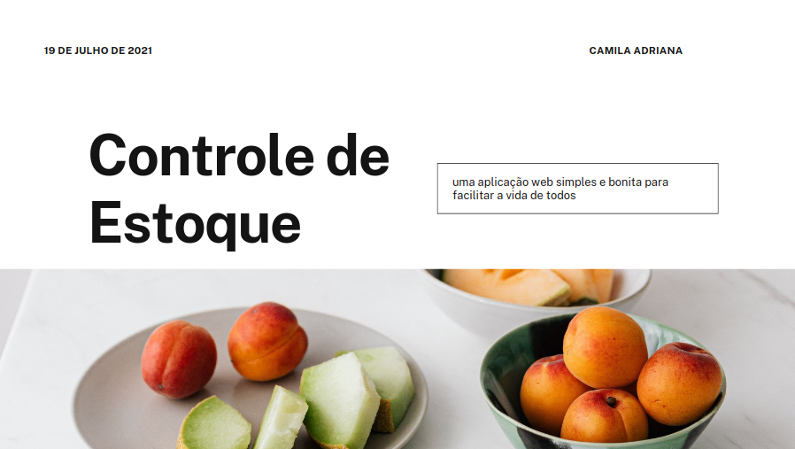

<h1 align="center">Controle de Estoque</h1>

Criar uma aplicação de Controle de Estoque onde a mesma tenha um design simples e belo, com intuito de promover o aprendizado utilizando o framework Django

<h4 align="center"> 
	🚧  Status 🚀 Em reforma...  🚧
</h4>

<h1 align="center">
  
</h1>

Este repositório tem foco, na criação de uma aplicação de Controle de Estoque de um estabelecimento, interligado a um banco de dados provido pelo próprio Framework Django facilitando dessa forma a manipulação de seus dados.

Este projeto faz parte do meu portfólio pessoal, então, ficarei feliz caso você forneça algum feedback, código, estrutura, funcionalidade ou qualquer melhoria que você possa relatar para melhora-lo.Você pode usar este projeto como quiser, seja para estudar, fazer melhorias, você quem manda!.

<blockquote>
Este é um projeto totalmente grátis!
</blockquote>

Observação: Foi utilizado a distro Linux Mint(versão 20.1), caso ocorra algum problema na instalação, pesquise por conta própria a resolução do mesmo!
Uma dedicatória a Lucas Santus que fez para mim o README! 
      
